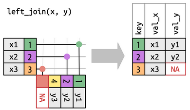
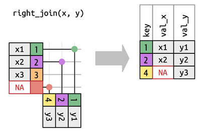
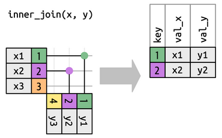
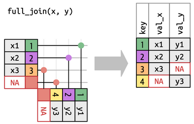
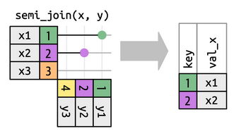
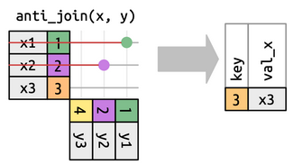

## Welcome!

Please feel free to ask questions verbally or in the chat, and I will do my best to answer them as we move through the training today.

We will take a break halfway through the training at 11am.

:::: notes
::: notes
If you have a question, I encourage you to ask it because someone else might have the same question and will benefit from the answer
:::
::::

## Recording logistics

Your continued participation indicates your consent to be recorded. This recording may be shared with the JHU community.

Any questions you ask verbally or in chat will be edited to protect your identity.

::: notes
PRESS RECORD
:::

## Troubleshooting and assistance

If you have questions throughout the webinar, include the error message you receive and the line of code that caused it.

Screenshots can also be helpful

::: notes
If you have a general question, I encourage you to message the full chat because someone else might have the same question and will benefit from the answer
:::

## JHU Data Services

### We help faculty, researchers, and students find, use, manage, visualize, and share data.

-   Find out more at [dataservices.library.jhu.edu](dataservices.library.jhu.edu)

-   Email us for a consultation at dataservices\@jhu.edu

-   Share your research data at [archive.data.jhu.edu](archive.data.jhu.edu)

## What you will learn today

-   How to reshape data using the powerful `dplyr` package

    -   Calculate new variables to analyze

    -   Summarize data differently to suit your unit of analysis

    -   Sort data to make it easier to visualize

-   How to use the pipe `|>` to simplify code

-   How to join two datasets together using different approaches and conditions

-   Additional resources for manipulating and joining data using `dplyr`

## You should have:

-   A template R script that we will fill out today called `class_script_blank.R`

-   dplyr cheatsheet

-   A link to a website where you can find the slides and final code from this workshop.

-   Basic knowledge of R

    -   Installing and loading packages

    -   Basic terminology of R or programming in general

::: notes
-   Put link in chat: <https://jhu-data-services.github.io/dplyr-quarto-site/>

-   Navigate to script in site and mention that while I will be switching between code and slides, the code will be here for their reference so keep this link open in case you miss something.

-   Mention that the point of the workshop is to learn by synthesizing information, but the code is there for you if you miss something or want to go back.

-   Go to RStudio and open up the file class_script_blank.R

-   Make sure everyone can open the file
:::

## Libraries

Today we'll be using the tidyverse library, which includes dplyr.

```{r}
#| warning: true

library(tidyverse)
```

::: notes
-   Got to the script and describe how to run code in R

-   Note the functions that will be masked by dplyr
:::

## Review: reading and viewing data {.incremental}

```{r}
# we'll be looking at data on Groundhog predictions
groundhogs <- readr::read_csv('https://raw.githubusercontent.com/rfordatascience/tidytuesday/master/data/2024/2024-01-30/groundhogs.csv')
predictions <- readr::read_csv('https://raw.githubusercontent.com/rfordatascience/tidytuesday/master/data/2024/2024-01-30/predictions.csv')
```

You can view a dataframe in R using `View()` or by clicking the object in the environment pane.

Let's take a look at our groundhog predictions dataset:

```{r}
head(predictions)
```

::: notes
-   Go to the script and run the lines to load in the data

-   Describe how to view the data from the environment pane

-   Go to the documentation for the dataset and describe a little about what the data represents <https://github.com/rfordatascience/tidytuesday/blob/main/data/2024/2024-01-30/readme.md>

-   Note that we are reading in two related datasets - briefly look at groundhogs and note that we'll be putting this dataset aside for now to work with later

-   Look more closely at predictions - one row per prediction, id represents the groundhog that made the prediction

-   Note the data types of each variable and highlight that transformations we will talk about today may operate differently on variables of different types
:::

## Groundhog Day 🕳️

::::: columns
::: {.column width="70%"}
According to Pennsylvania Dutch superstition, if a groundhog emerges from its burrow on February 2 and sees its shadow, winter will continue for 6 more weeks. No shadow means an early spring! The first and most famous prophesying groundhog is Punxsutawney Phil, but [87 other groundhogs have followed in his footsteps](https://groundhog-day.com/groundhogs), making their own predictions each year.
:::

::: {.column width="30%"}
{fig-align="center"}
:::
:::::

## Our task today

-   We are researchers studying whether groundhogs can really predict an early spring.

-   To start our research, we'll need to conduct some exploratory analyses about patterns in groundhog predictions so we can compare them to weather trends.

-   Over the course of this workshop, we'll be creating summary tables that will set us up for further visualization and analysis.

::: notes
-   Is there any pattern to groundhog predictions or are they truly random?

-   We're not going to do any advanced statistical analysis today, but reshaping data is an important and necessary first step in your analysis.

-   Different types of analysis may require data to be shaped different.
:::

## The dplyr package

::: incremental
-   dplyr is a "grammar" of data manipulation

-   dplyr is a set of R functions that work together to help you solve the most common data manipulation challenges, like:

    ::: incremental
    -   Filtering out certain rows and sorting your data

    -   Calculating a new column based on existing columns

    -   Grouping and summarizing data

    -   Joining data from different sources
    :::
:::

{fig-align="right" width="172"}

::: notes
-   dplyr is the package from the tidyverse that is best suited for data manipulation and joining.
:::

## dplyr grammar

::: incremental
-   dplyr's core is a set functions that can be divided into 4 groups based on what they operate across:

    -   rows

    -   columns

    -   groups

    -   tables

-   We'll call these the dplyr *verbs*

-   dplyr also contains a number of useful *helper functions* that operate on single values or arrays. We'll introduce those along the way.
:::

::: notes
-   The way all of the tidyverse packages are structured is that they are very standardized in terms of how the functions work with data

-   This makes it easier to infer how functions will work even if you've never used them before

-   That doesn't mean there is a learning curve, but once you understand the structure behind the functions, you'll start to see them as different tools that can build the dataset you need for your research
:::

## anatomy of a dplyr verb

In every dplyr verb:

::: incremental
-   the first argument is always dataframe

-   The subsequent arguments describe what to do with the dataframe, using the variable names (without quotes)

-   the output is always a new dataframe

-   arguments with a . in front of them are settings for the function, not variable names
:::

::: notes
-   All of the dplyr verbs have a few things in common

-   This makes them easy to use together because the output of each can be seen as the input to another
:::

## row verbs

-   `filter()` : keep rows based on the value of one or more columns

-   `arrange()`: changes the row order based on one or more columns

-   `distinct()`: finds all the unique rows based on the values of one or more columns

::: notes
-   Row verbs operate across multiple rows

-   They can change the order or number of rows in the dataset
:::

## row verbs: `filter()`

-   `filter()` : keep rows based on the value of one or more columns

-   You can compose conditions using `==`, `>`, `<`, `>=`, `<=`, `!=`, and include multiple conditions using `&` or `|`

-   The `%in%` operator can serve as a combination of `|` and `==`

::: notes
-   Filter can take us from more rows to less rows

-   Open up the class script and invite students to follow along as you work through the first two examples

-   Show alternative ways of representing conditions and demonstrate how you would use the pipe

-   Show how filter can work across multiple columns
:::

## row verbs: `filter()`

```{r}
# find groundhog predictions from 2020
filter(predictions, year == 2020)

# find groundhog predictions from 2020 and 2021
filter(predictions, year == 2020 | year == 2021)
filter(predictions, year %in% c(2020, 2021))
```

## the pipe operator 🔗

::: incremental
-   Each verb does one thing very well, so you'll typically chain together multiple verbs. The **pipe** helps you do this by passing the result of every action onto the next action.

-   The pipe is represented in R as `|>`. Everything to the left of the pipe is passed as the first argument to the thing immediately to the right of the pipe.

-   `x |> f(y)` is equivalent to `f(x, y)`

-   `x |> f(y) |> g(x)` is equivalent to`g(f(x,y), z)`

-   ⚠️ The pipe does not save new variables automatically
:::

::: notes
-   The pipe helps us build up our ideal dataframe one step at a time.

-   It saves us from having to create new variables every time we do anything to our data

-   Because the first argument of every dplyr verb is a dataframe, the pipe can be used to feed a dataframe into the first argument of a verb

-   And because the output of every verb is a dataframe, the output of every dplyr verb can be piped into the first input of the next

-   dplyr and the pipe work very well together for this reason

-   Some of you maybe be familiar with the old pipe, %\>%, which came from a library called magrittr. The pipe is now integrated into base R so there's nothing extra you need to install to use it
:::

## `filter()`: your turn!

Find groundhog predictions between 1900 and 2000. Bonus: Use the pipe in your answer!

::: notes
-   Give students a minute to work through it themselves, direct them to write their answer under the next comment in the script

-   After a minute or two invite students to paste their answer into the chat

-   Move to the next slide and discuss the solution, open the script if you need to
:::

## `filter()`: your turn!

```{r}
# find predictions between 1900 and 2000
predictions |>
  filter(year >= 1900 & year <= 2000)
```

## `filter()`: useful helper functions

-   `between()` tests if a variable falls between two values (inclusive)

-   `near()` tests if a variable is within a certain range of a given number (you can set the tolerance)

-   `is.na()` tests whether the variable is NA. Use is conjunction with `!` to filter for non-NA values.

::: notes
-   Sometimes you want to filter a dataframe based on more complex conditions

-   These helper functions represent things you can do with logical or mathematical operations, but they are cleaner and more intelligible.
:::

## row verbs: `arrange()`

`arrange()`: changes the row order based on one or more columns

You can wrap the columns with `desc()` to sort in descending order

::::: columns
::: {.column width="50%"}
```{r}
# sort our predictions by year
arrange(predictions, year)
```
:::

::: {.column width="50%"}
```{r}
# sort our predictions by year, descending
arrange(predictions, desc(year))
```
:::
:::::

::: notes
-   Sometimes it's helpful to sort your dataframe so you can view trends at a glance

-   Arrange allows you to sort your data by one or more columns, descending or ascending

-   When you specify multiple columns, each subsequent column acts as a tiebreak
:::

## row verbs: `distinct()`

`distinct()`: finds all the unique values or combinations of values of the column(s) supplied to it.

-   Without any additional inputs, `distinct()` finds and keeps all unique rows

-   You can optionally supply one or more columns to check for distinct combinations of

-   If you want to retain all of the columns, set the `.keep_all` argument to `TRUE`

::: notes
-   Go to script and go through 4 examples to illustrate the behavior of distinct, note the number of rows that are retained

-   You'll notice that when you specify a column, by default only that column is retained

-   You can keep all columns with the .keep_all argument

-   Note that distinct only retains the first occurence of the variable(s) you specify. If you are only keeping those variables, that doesn't matter so much, but if you keep all variables, note that you may want to be intentional about how you sort your dataframe if you want a certain unique row retained

-   For instance, if we had a variable for time of prediction and you wanted to keep the first prediction from each year, you would sort the data by year, time, and then use distinct()
:::

## Prediction trends over time

-   Our final goal is to learn whether groundhogs can really predict an early spring.

-   The first thing we'd like to know is the percent of groundhogs that predict an early spring each year.

-   We want a table with one row per year that gives us the percentage of groundhogs that saw their shadow that year.

## 🚩checkpoint: row verbs

Let's put it all together!

-   Check for and remove duplicate predictions

-   Remove rows with no prediction

-   Sort the result by year, descending

-   Assign the result to predictions, overwriting the previous dataframe

::: notes
-   Open up the script and look at the predictions table in R

-   We'll mainly be working with our predictions table to answer our question of whether there is any pattern to groundhog predictions

-   There are a few things we want to change and verify in the data before we start calculating new variabales

-   The way I like to approach data reshaping is to envision the table I want to end up with and work backwards from there. For our question, it would be nice to have table with one row per year that gives the percentage of groundhogs that saw their shadow that year.

-   In order to make this percentage, we need to have counts of the number of groundhogs that saw their shadow in a given year, and the total number that made predictions each year

-   Once you have more experience using dplyr, you'll start to be able to identify things that will throw off your desired groupings and calculations.

-   One thing that jumps out to me about the predictions table is that there are rows that represent years with no recorded prediction - we want to filter these out because they will mess up our counts of predictions each year

-   We also want to make sure there is only one record per groundhog per year

-   Finally, we want to sort the dataframe in descending order simply because the later years are more interesting because there are more groundhogs on the scene.

-   Write the code in the script (start with using distinct to check for duplicate predictions).
:::

## 🚩checkpoint: row verbs

```{r}
# create a subset of your data where "shadow" has a value of either TRUE or FALSE. Make sure there are no duplicate rows, and sort the result by ascending year.
predictions <- predictions |>
  filter(shadow %in% c(TRUE, FALSE)) |>
  # distinct(year, id, .keep_all = TRUE) |> # if we found duplicates, we'd need this line!
  arrange(desc(year))
```

::: notes
:::

## group verbs

-   `group_by()` groups your dataframe

-   `summarize()` reduces the dataframe to a summary table with one row for each group and one or more calculations by group

::: notes
-   the grouping verbs create and operate across groups

-   In my opinion, this is the bread and butter of dplyr

-   These are the functions that allow you to change the unit of analysis of your data by collapsing it into different groups, and you can do some really powerful calculations inside of summarize
:::

## group verbs: `group_by()`

`group_by()` groups your dataframe

On it's own, it doesn't change your data. But you can feed the "grouped" output into other special functions to apply different transformations to each group in your data.

```{r}
# group predictions by year 
predictions |>
  group_by(year)
```

::: notes
-   Run this code in the script and show that the output now lists a group and tells us how many unique values are in that group

-   Grouped data can be fed into summarize()
:::

## group verbs: `summarize()`

-   `summarize()` reduces the dataframe to a summary table with one row for each group and one or more calculations by group

-   The syntax is `dataframe |> group_by(column) |> summarize(new_variable = summary_function(..))`

-   One of the most important summary functions is `n()`, which counts the observations (rows) in each group.

-   Let's try it together: How many predictions were made in each year?

::: notes
-   summarize is used after group_by to calculate data across the groups you've specified

-   summarize can be used to answer questions like "what is the average flight cost in each month"

-   You can use any helper function in any library to summarize data inside of summarize, which is what makes it so powerful

-   Open the script and work through the example

-   Point out that because each row in our dataframe represents a prediction (look at the documentation to confirm this), the question is equivalent to "how many rows of data are there for each year" so we can use n()

-   Point out that we've changed both the number of rows in the dataframe and the unit of analysis
:::

## `n()`within `summarize()`

```{r}
# How many predictions were made in each year?
predictions |>
  group_by(year) |>
  summarize(n_predictions = n()) |>
  arrange(desc(year))
```

## `summarize()` helper functions

-   Other powerful summary functions include:

    -   `n_distinct()`: counts the number of distinct values of a given column within a group

    -   `max()` and `min()`: finds the max and min value of a given column within a group

-   Exercises:

    -   How many different groundhogs made predictions each year?

    -   What is the first year each groundhog made a prediction?

::: notes
-   Open the script and work through the examples

-   For each question, ask attendees which variable they would group by and what summary function they would use within summarize
:::

## `summarize()` helper functions

```{r}
# How many different groundhogs made predictions each year?
predictions |>
  group_by(year) |>
  summarize(n_groundhogs = n_distinct(id)) |>
  arrange(desc(n_groundhogs))
```

## `summarize()` helper functions

```{r}
# What is the first year each groundhog made a prediction?
predictions |>
  group_by(id) |>
  summarize(first_prediction = min(year))
```

## `sum()` within `summarize()`

-   `sum()`: finds the sum of a given column within a group. You can also specify conditions within `sum()` to calculate the number of records within a group that meet a certain condition.

-   Exercise: Let's return to our dataframe with the number of predictions in each year. How would we add a column for the number of shadows seen in each year?

::: notes
-   sum is a deceiving flexible helper function

-   For numeric values, it simply sums them up - so for example, if we had a column for the number of people watching each prediction, we could use sum with group by and summarize to get the sum of people watching all predictions in each year

-   A really powerful way to use sum is to specify conditions within it to calculate the number of records within a group that meet a certain condition

-   If you use a condition within sum rather than a column name, it behaves as a counter rather than a summer

-   open the script and copy and paste the previous summarized data

-   Work through the example with attendees
:::

## `sum()` within `summarize()`

```{r}
# Let's return to our dataframe with the number of predictions in each year. 
# How would we add a column for the number of shadows seen in each year?
predictions |>
  group_by(year) |>
  summarize(n_predictions = n(),
            n_shadows = sum(shadow == TRUE)) 
```

## 🚩checkpoint: group verbs

Your turn! Create a dataframe with three variables:

::: nonincremental
-   groundhog id

-   the number of total predictions each groundhog has made

-   the number of times each groundhog has seen it's shadow.
:::

::: notes
For this one, direct attendees to take 5 minutes to try it by themselves, then come back and go over any questions
:::

## 🚩checkpoint: group verbs

```{r}
# Create a dataframe with 3 variables: 
# groundhog id
# the number of total predictions each groundhog has made
# the number of times each groundhog has seen its shadow
predictions |>
  group_by(id) |>
  summarize(n_predictions = n(),
            n_shadows = sum(shadow == TRUE))
```

::: notes
Probably break at this point if it's near 45 minutes in!
:::

## column verbs

Now that we've calculated some summary variables within the groups that interest us (groundhog and year), we might want to use those summary variables to calculate more new variables.

-   `mutate()` adds new columns calculated from existing columns

-   `select()` keeps a subset of columns

-   `rename()` renames columns

::: notes
-   Column verbs operate across multiple columns

-   They can add, remove, or change the order of columns
:::

## column verbs: `mutate()`

`mutate()` adds new columns calculated from existing columns

By default, columns are added on the left side of the dataframe. You can use the `.before` or `.after` to specify where the new variable should fall

```{r}
# calculate how many characters are in the details field and put the variable after id
predictions |>
  mutate(details_length = nchar(details), .after = id)
```

::: notes
-   You use helper functions inside of mutate just like summarize

-   The different between summarize and mutate is that summarize works across groups while mutate works across columns

-   In this example we're calculating the number of characters in the details field of each row. You'll see that we didn't need to group the data first, and that each row has a different value
:::

## re-coding data with `mutate()`

`if_else()` tests for a condition and returns one value if true and another if false.

```{r}
# create a column that indicates whether the prediction was made by Punxatawney Phil
predictions |> 
  mutate(phil = if_else(id == 1, 'TRUE', 'FALSE'))
```

::: notes
-   Inside of mutate, you can use conditional helper functions to create a new column based on conditions you set on other columns

-   In this example, we create a column called Phil that looks at the id column to determine whether the prediction was made by Punxatawney Phil.

-   The if_else function lets us specify two inverse conditions, so that value of the column can be one of two things based on whether the condition is true or false
:::

## re-coding data with `mutate()`

`case_when()` tests for multiple conditions and maps them to values accordingly.

```{r}
# create a column that indicates the century of the predictions
predictions |> 
  mutate(century = case_when(year < 1900 ~ '19',
                             year < 2000 & year >= 1900 ~ '20',
                             year >= 2000 ~ '21',
                             TRUE ~ 'Year out of range'))
```

::: notes
-   If we want more than one condition, we can use the case_when function inside of mutate to specify what the value of a new column should be

-   case_when evaluates the conditions in order, so if more than one condition is met, it will set the value as the one outlined by the latest condition

-   By default, if none of the conditions are met, the value is set to NA, but you can use the TRUE condition to specify a value to set if no condition is met
:::

## column verbs: `select()` and `rename()`

-   `select()` keeps a subset of columns

    -   You can select by name, series, test for data type (`select(where(is.character()))`) or use other helper functions such as `starts_with()`, `ends_with()`, or `contains()`

    -   You can rename variables as you select them with `=` , with the new name on the left and old on the right

-   `rename()` works the same way as renaming in select with `=`

::: notes
-   select and rename are pretty straightforward

-   select allows you to subset columns but it also allows you to reorder them (just select them in the order you want them) or rename them inside of select

-   Rename is purely for renaming columns
:::

## 🚩checkpoint: put it all together!

Let's return to our original question: What is the rate of shadows seen each year? Working off of our table with the number of predictions and number of shadows seen per **year**, lets:

-   Add a column called `shadow_percent` that gives the percentage of groundhogs that saw their shadow that year.

-   Filter for years that had at least 5 predictions

-   Keep only the variables `year` and `shadow_percent`, and rename year to `prediction_year`

-   Assign the result to a variable `year_predictions`

::: notes
-   Open up the script and copy and paste what we will be working on

-   Prompt attendees to add the things outlined on this slide - give them 2-3 minutes
:::

## 🚩checkpoint: put it all together!

```{r}
year_predictions <- predictions |>
  group_by(year) |>
  summarize(n_predictions = n(),
            n_shadows = sum(shadow == TRUE)) |>
  mutate(shadow_percent = n_shadows/n_predictions) |>
  filter(n_predictions > 5) |>
  select(year, shadow_percent) |>
  rename(prediction_year = year)
```

::: notes
-   Show answer and take questions or clarifications. Show how it works via live code if needed.
:::

## table verbs: joining data

We've focused on **year** as our main unit of analysis so far, and learned a lot with the mere 4 variables in our `predictions` table!

Let's turn our attention to the `groundhogs` table - some of these groundhogs are not like the others...

If we wanted to filter out "alternative groundhogs" from the prediction calculations, we need to add information about each groundhog from the `groundhogs` table to `predictions`

```{r}
head(groundhogs)
```

::: notes
-   Open the script and look at the groundhogs table

-   Point out the `is_groundhog` variable

-   Let's join groundhogs to predictions!
:::

## join terminology

There are two main types of join:

-   **mutating joins** add variables from one dataframe to another based on matching characteristics between the two

-   **filtering joins** subset one dataframe based on matching characteristics with another dataframe

::: notes
-   mutating joins are what we think of when we think of joins; they add additional data to a dataset

-   filtering joins aren't joins in the traditional sense because they don't add data, they are just advanced ways of filtering dataframes based on another dataframe
:::

## join terminology 🗝️

-   Every join involves a **primary key** and a **foreign key**

    -   A primary key is a variable or set of variables that uniquely identifies an observation

    -   A foreign key is just another table's primary key that matches your tables' primary key. It might have a different name or be spread across more or less variables.

-   The first step when joining data is to identify the primary and foreign keys you'll work with

-   Always check that your primary key is unique to each row! Foreign keys may or may not be unique.

::: notes
-   Every join involves a primary key and a foreign key

-   A primary key is a variable or set of variables that uniquely identifies an observation. They should uniquely identify each row and there also shouldn't be any missing values in your primary key

-   Foreign keys are what matches your primary key in another table

-   The first step when joining data is to identify the primary and foreign keys you'll work with

-   While your primary keys absolutely have to be unique, your foreign keys don't necessarily have to be, but it's best practice for everything to be one to one

-   When possible, you want unique primary and foreign keys
:::

## joining predictions & groundhogs

```{r}
head(predictions, 3)
```

```{r}
head(groundhogs, 3)
```

::: notes
-   We want to determine if there is a difference between the average shadow prediction rate of different types of groundhogs

-   Ask attendees what will our primary table be?

-   We want to add the variables from groundhogs to our predictions table

-   Ask what attendees think the primary and foreign key will be
:::

## joining predictions & groundhogs

-   How would we determine if there is a difference between the yearly shadow prediction rate of real vs. alternative groundhogs?

-   primary key: `id` in `predictions`

-   foreign key: `id` in `groundhogs`

## joining predictions & groundhogs

-   We want to add the variables from `groundhogs` to our `predictions` table

-   We'll need a **mutating join**, specifically a **left join**.

-   A **left join** retains all rows in the left dataframe, and adds additional data in from the right dataframe if the keys match.

-   `left_join(x, y, join_by(x.key == y.key))`

::: notes
-   We want to add the variables from `groundhogs` to our `predictions` table

-   We'll need a **mutating join because we want to add data**, specifically a **left join**.

-   A **left join** retains all rows in the left dataframe, and adds additional data in from the right dataframe if the keys match.

-   ask attendees what dataframe will be on the left and which on the right

-   Open the script and write the code
:::

## joining predictions & groundhogs

```{r}
predictions_groundhogs <- left_join(predictions, groundhogs, join_by(id == id))
```

## more mutating joins

`right_join()` keeps everything in the right dataframe and adds in data from the left

::::: columns
::: {.column width="50%"}
{fig-align="center"}
:::

::: {.column width="50%"}
{fig-align="center"}
:::
:::::

## more mutating joins

`inner_join()` keeps rows with keys that appear in both dataframes

`full_join()` keeps all rows from both dataframes

::::: columns
::: {.column width="50%"}
{fig-align="center"}
:::

::: {.column width="50%"}
{fig-align="center"}
:::
:::::

## filtering joins

filtering joins subset one dataframe based on matching characteristics with another dataframe. In filtering

`semi_join(x, y)` keeps all rows in x with a match in y

`anti_join(x, y)` returns all rows in x without a match in y

::::: columns
::: {.column width="50%"}
{fig-align="center"}
:::

::: {.column width="50%"}
{fig-align="center"}
:::
:::::

## join exercises

-   `predictions` contains one row per 1317 unique predictions

-   `groundhogs` contains one row per 75 unique groundhogs

-   Every groundhog in `predictions` appears in `groundhogs` and vice versa

    -   How many rows would each of the following joins have: right join with `groundhogs` on the right, inner join, full join?

::: notes
-   trick question - they are all the same because every groundhog appears in predictions and every groundhog id in predictions appears in groundhogs - one to one relationship
:::

## more complex join conditions

-   Within `join_by()`, we can use more complex conditions than whether `key == key`

-   You can use other numeric operations like `>`, `<`, etc.

-   The `closest()` function matches the closest key to another key based on some criteria (closest value at all, closest value that is larger, etc.)

-   `between()` and `within()` can test whether a value falls between two other values. This is useful if you want to join events that happened within a given time span.

## other table verbs

-   `bind_rows()` pastes rows onto the bottom of a dataframe

    -   the dataframes must have the same columns

-   `bind_cols()` pastes columns onto the right of a dataframe.

-   There are no conditions in these functions, you can think of them as copy-and-paste.

## 🏁 finish line

Let's put everything we've learned together!

Using our joined `predictions_groundhogs` table, let's create a summary table comparing the rate at which real groundhogs vs alternative groundhogs saw their shadows each year.

## 🏁 finish line

```{r}
predictions_groundhogs |>
  group_by(year, is_groundhog) |>
  summarize(n_predictions = n(),
            n_shadows = sum(shadow == TRUE)) |>
  mutate(percent_shadow = n_shadows/n_predictions) |>
  arrange(desc(year), is_groundhog)
```

## 🏆 bonus exercises

-   Write code to calculate the column `predictions_count` in `groundhogs`

-   Write code to calculate the column `is_groundhog` in `groundhogs`

-   Calculate the proportion of groundhogs from each country that make predictions each year

-   Add a column to groundhogs indicating the first year each groundhog saw its shadow

-   Create a summary table showing the first year each type of groundhog made a prediction

## summary: verbs & helper functions

::::: columns
::: {.column width="50%"}
**Verbs:**

-   `filter()` , `arrange()` , `distinct()`

-   `group_by()` , `summarize()`

-   `mutate()` , `select()`, `rename()`

-   `left_`, `right_`, `inner_`, `full_`, `semi_`, `anti_` joins

-   `bind` `_rows` and `_cols`
:::

::: {.column width="50%"}
**Helper functions:**

-   `desc()`

-   `n()`, `n_distinct()`, `min()`, `max()` , `sum()`

-   `if_else()` and `case_when()`

-   `between()` and `within()`
:::
:::::

## resources

-   R for Data Science 2e, Chapters [3](https://r4ds.hadley.nz/data-transform) & [19](https://r4ds.hadley.nz/joins)

-   [dplyr documentation](https://dplyr.tidyverse.org/index.html)

-   [Software Carpentries: Data Frame Manipulation with dplyr](https://swcarpentry.github.io/r-novice-gapminder/13-dplyr.html)

-   Website for the workshop: <https://jhu-data-services.github.io/dplyr-quarto-site/>

## thank you! 🙏

Please take the post-workshop survey: <https://bit.ly/dplyr-survey>

**Future trainings:**

-   Introduction to Data Visualization in R: 9/30 1-4pm

-   Transforming your Data in Python with pandas: 10/15 10am-12pm & 10/16 10am-12pm

-   Hopkins AI Lab for Data-Driven Research: Opportunities, Challenges, and Best Practices: 10/28 12-1:30pm & 10/29 12-1:30pm

::: notes
link <https://dataservices.library.jhu.edu/training-workshops/calendar/> in chat
:::
